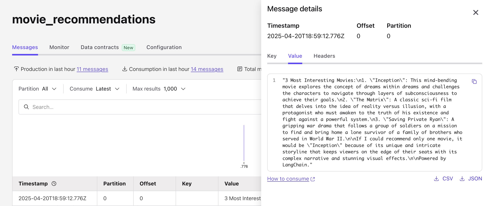

# Using LangChain with Confluent and MongoDB

<br>

# Overview

The question was: can you use LangChain with Confluent and MongoDB together.

The answer is: yes, you can.

This repo is overkill for sure, but it shows off LangChain’s orchestration capability even in a simple ETL-like flow with Confluent and MongoDB Atlas. It's meant to do 1 simple thing. Prove it out on your own without complicated infrastructure. Hands-on, but super easy to do. This repo:
- uses MongoDB Atlas's existing Sample netflix movie data
- asks OpenAI for a summary of recommendations based on results retrieved from MongoDB Atlas
- inserts the LLM response into a Confluent Kafka topic
- orchestrates it via LangChain

And yes, yes, yes, I know. Why do ETL-like flows like this when there is growing popularity with other protocols like MCP and A2A and such for agentic-AI in particuar? Plus, aren't there a million other things you could do with LangChain? Yes. This is merely meant to show you how to use LangChain libraries and simple workflow orchestration.

As is there are other ways to use LLMs. For instance, the Mongo data already has embeddings. You could query that directly in Python or you could query it in Confluent Flink SQL. You could even create embeddings in Confluent Flink SQL using something like ML_PREDICT. This is just meant to do what it's doing above, that's all. And so on, you get the idea.

The assumption here is you are comfortable logging into Confluent Cloud, have an OpenAI API key and doing things like running python programs and installing required libraries from pip.

Remember to tear down your environment as needed in Confluent Cloud and Mongo to avoid getting charged.

<br>

## A quick word about the main Python program

The core elements are trivial:

Querying the MongoDB Atlas database for the most popular movies by IMDB rating with sufficient votes that also have posters!
```python
  query = {"imdb.rating": {"$exists": True, "$gte": 8.0}, "imdb.votes": {"$exists": True, "$gte": 50000}, "poster": {"$exists": True}}
  projection = {"title": 1, "plot": 1, "fullplot": 1, "genres": 1,"imdb.rating": 1, "year": 1,"_id": 0}
```

Passing in the database resultset to the LLM
```python
  llm = ChatOpenAI(model=OPENAI_MODEL, temperature=0.7, api_key=OPENAI_API_KEY)
  response = llm.invoke([HumanMessage(content=prompt)])
```

Producing the LLM result to the Confluent kakfa topic
```python
  producer.produce(CC_TOPIC_NAME, value=summary, callback=delivery_report)
  producer.flush()
```

Adding the ETL-like processing steps (nodes/edges) for LangChain to execute
```python
  workflow = build_graph()
  workflow.invoke(initial_state)
```
```python
  # Add nodes
  workflow.add_node("load_movies", load_movies)

  # Define flow
  workflow.add_edge("__start__", "load_movies")
```

<br>

## Load the free sample netflix data into your MongoDB Atlas database

Load sample data:  
- https://www.mongodb.com/docs/atlas/sample-data/#load-data-into-atlas  
- (Choose the `sample_mflix` dataset)

Use these naming conventions (if you use different naming conventions please update the scripts in this repo accordingly):
- Database: `sample_mflix`

<br>

## Login to Confluent Cloud and create a topic

Create a topic named 'movie_recommendations' or edit your .env file to use a different name.

<br>

## Run the Python main program

Edit your [`.env`](./.env) file with your OpenAI credentials.

Edit your [`client.properties`](./.env) file with your Confluent Cloud credentials.

Then run the python main program:

```shell
python main.py
```

📄 View the script: [`main.py`](./main.py)

<br>

## What you should see

You can see the workflow steps progress in your console.

<pre>
🎬 Running LangChain Movie Recommender Summarizer workflow...

📥 Step 1: Querying MongoDB for movies...
✅ Loaded 20 most popular movies by IMDB rating (with sufficient votes)

🤖 Step 2: Summarizing movies with OpenAI...
📝 Summary created by LLM:3 Most Interesting Movies:
1. "Inception": This mind-bending movie explores the concept of dreams within dreams and challenges the characters to navigate through layers of subconsciousness to achieve their goals.
2. "The Matrix": A classic sci-fi film that delves into the idea of reality versus illusion, with a protagonist who must awaken to the truth of his existence and fight against a powerful system.
3. "Saving Private Ryan": A gripping war drama that follows a group of soldiers on a mission to find and bring home a lone survivor of a family of brothers who served in World War II.

If I could recommend only one movie, it would be "Inception" because of its unique and intricate storyline that keeps viewers on the edge of their seats with its complex narrative and stunning visual effects.

Powered by LangChain....

📤 Step 3: Publishing to Kafka...
%6|1745175015.938|GETSUBSCRIPTIONS|mymoviesclientid.2025.04.01#producer-1| [thrd:main]: Telemetry client instance id changed from AAAAAAAAAAAAAAAAAAAAAA to mR3YOiq6RkuqsAOpW2yW/g
✅ Message delivered to movie_recommendations

✅ LangChain Movie Recommender Demo Summarizer workflow complete!
</pre>

And if everything goes right, you should be able to view the data you produced in your Confluent Kafka topic!

<table>
  <tr>
    <td>
      <strong>`topic movie_recommendations`</strong><br>
      <a href="./screenshot_movie_recs.jpg" target="_blank">
        
      </a>
    </td>
  </tr>
</table>

<br> 

## Final thoughts

Hope that helps answer the question.

Just remember to tear your environment down once you're done.
